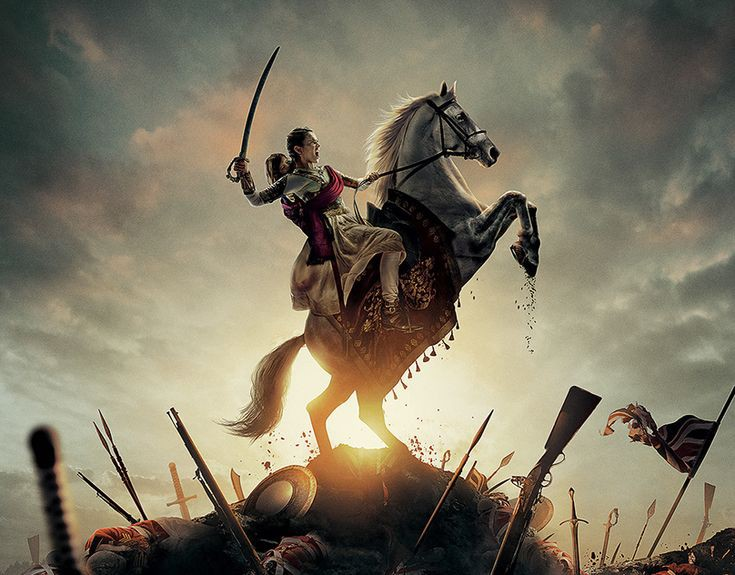

<!DOCTYPE html>
<html lang="eng">
    <head>
        <meta charset="UTF-8">
        <title>The Queen of Jhansi</title>
        
    </head>
    <body>
        

            
            <h1>Manikarnika: The Queen of Jhansi</h1>
            
Theatrical release poster

            <h2>Directed by</h2>
            <a class="Directed" href="">Krish Jagarlamudi, Kangana Ranaut</a>
            <h2>Screenplay by</h2>
            <a class="Screenplay" href="">V.Vijayendra Prasad</a>
            <h2>Dialogues by</h2>
            
Sunish Tom

            <h2>Story by</h2>
            
V.Vijayendra Prasad

            <h2>Produced by</h2>
            <a class="Produced" href="">Zee Studios Kamal Jain Abhishek Vyas</a>
            <h2>Starring</h2>
            <a class="Starring" href="">Kangana Ranaut Jisshu Sengupta Mohammed Zeeshan Ayyub Ankita 
                Lokhande
            </a>
            <h2>Narrated by</h2>
            <a class="Narrated" href="">Amitabh Bachchan</a>
            <h2>Cinematography</h2>
            <a class="Cinematography" href="">Kiran Deohans Gnana Shekar V.S</a>
            <h2>Edited by</h2>
            
Rameshwar S Bhagat Suraj jagtab

            <h2>Music by</h2>
            
<strong>Songs:</strong>

            <a class="Music" href="">Shankar-Ehsaan-Loy</a>
            
<strong>Score:</strong>

            <a class="Score" href="">Sanchit Balhara Ankit Balhara</a>
            <h2>Production</h2>
            <a class="Production" href="">Zee Studios</a>
            <h2>Companies</h2>
            
Kairos Kontent Studios

            <h2>Distributed by</h2>
            
Zee Studioss

            <h2>Release date</h2>
            
25 January 2019

            <h2>Running time</h2>
            
150 minutes

            <h2>Country</h2>
            
India

            <h2>Language</h2>
            
Hindi

            <h2>Budget</h2>
            
99-125 crore

            <h2>Box office</h2>
            
132.95 crore

        

    </body>
</html>
